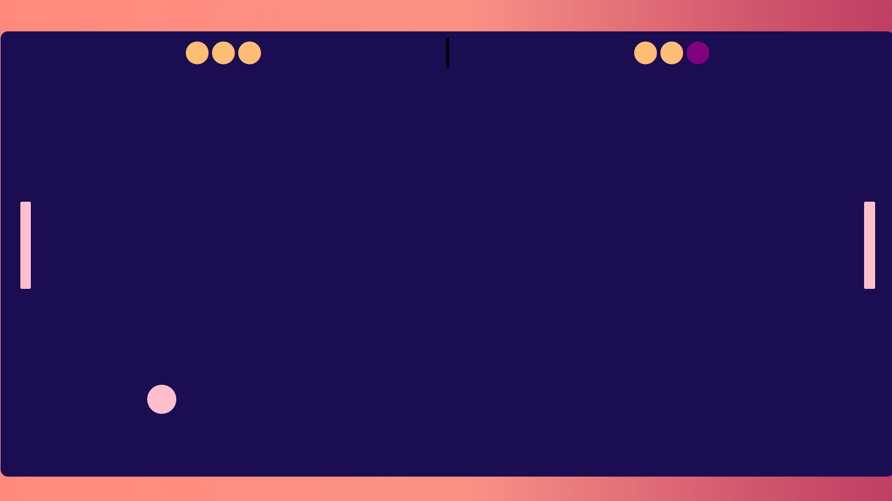

# Ping-Pong-Game 🏓
<h3>
 A ping pong game which can be played between two players  This is made using only html, css and javascript without any external libraries ✨. 
So this will be great for beginner's to Contribute 😇.
</h3>

<h2> Instructions 📜</h2>

🔰 Player 1 can use 'W' and 'S' key of the keyboard to make the paddle up and down. 
🔰 Player 2 can use "Arrow Up 🔼" and "Arrow Down 🔽" key of the  keyboard to make the paddle up and down. 
🔰 Both the players get three chances.
One who gets 3 penalites first looses the game and other player wins 🎉.

<h2 align="center">Contributers are Most Welcome✨</h2>
<h3 align="center">_______________Made with 💜_______________</h3>
